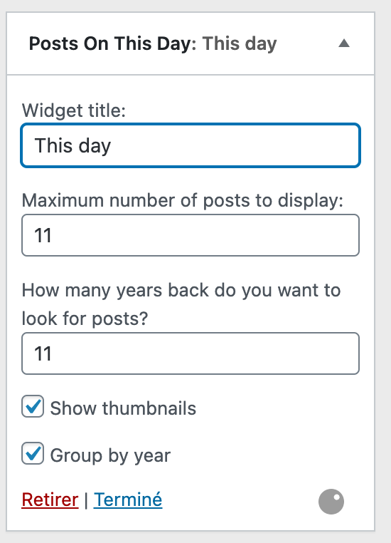

	
	<h1>Posts On This Day</h1>
	

		<b>WordPress plugin to display a list of posts published "on this day" in years past. A good little bit of nostalgia for your blog.</b>
	

	 
	 
	 

If you're familiar with services like Google Photos, TimeHop, or even Facebook Memories, you most likely enjoyed getting little reminders of what happened in your life in years past. This plugin brings this feature to your WordPress site. It is available as a block for the block editor and block-based themes, as well as a legacy widget.

This plugin is also what you could call "a feat of over-engineering". :) As you'll see if you browse this GitHub repository, you'll find that this simple plugin uses dependencies that would not typically be needed. That's mostly because this plugin is also a playground for me, it allows me to play with tools I want to experiment with. So... It works well, but don't be surprised that there is so much under the hood. :)

## Install

You can get that plugin on your WordPress site by going to Plugins > Add New and searching for "Posts On This Day". You can also [find the plugin in the WordPress.org plugin directory](https://wordpress.org/plugins/posts-on-this-day/).

Once installed, add the "Posts On This Day" block to any page or template from the block inserter. You can also use the legacy widget via Appearance > Widgets.

To install it from this GitHub repo, clone the repo in your plugin's directory (usually `wp-content/plugins`), and build it with `composer install && npm install && npm run build`.

## Contribute

I'll be super happy to see any PRs and suggestions for improvements! [Check the contributing guide here](.github/CONTRIBUTING.md) to send in your first contribution.

## Translate

Since the plugin lives in the WordPress.org plugin directory, you can [submit translations for your own language here](https://translate.wordpress.org/projects/wp-plugins/posts-on-this-day/).

## Screenshots

### Widget Settings

## Built with

- [Jetpack Autoloader](https://github.com/Automattic/Jetpack-autoloader) - A custom autoloader for Composer.
- [Jetpack Coding Standards](https://github.com/Automattic/Jetpack-codesniffer) - phpcs sniffs based off WP Core and some additions used by the Jetpack plugin.
- [Brain Monkey](https://brain-wp.github.io/BrainMonkey/) - mock WordPress functions in PHPUnit tests without requiring a full WordPress environment.
- Banner image - [rirri01](https://unsplash.com/@rirri01).

And more. See `composer.json` to find out more.

## License

Jetpack is licensed under [GNU General Public License v2 (or later)](./license.txt).
