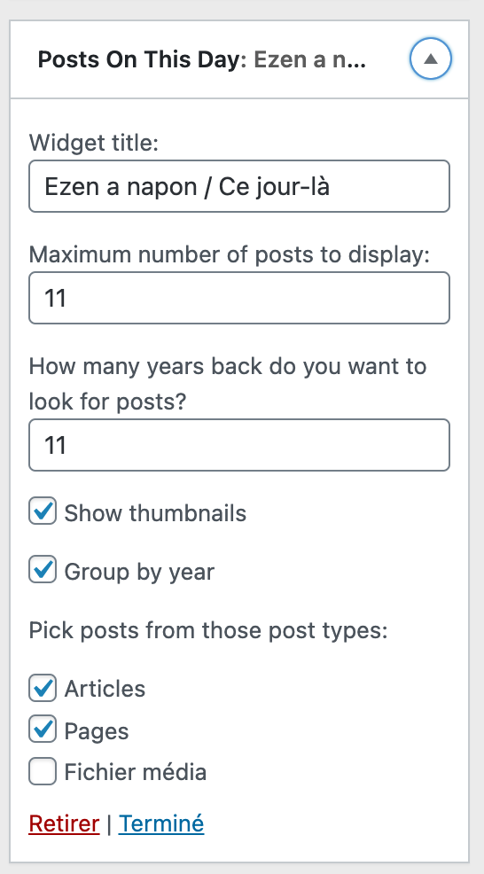

	
	<h1>Posts On This Day</h1>
	

		<b>WordPress plugin to display a list of posts published "on this day" in years past, in a widget. A good little bit of nostalgia for your blog.</b>
	

	 
	 
	 

If you're familiar with services like Google Photos, TimeHop, or even Facebook Memories, you most likely enjoyed getting little reminders of what happened in your life in years past. This little widget brings this feature to your WordPRess site.

This plugin is also what you could call "a feat of over-engineering". :) As you'll see if you browse this GitHub repository, you'll find that this simple widget uses dependencies that would not typically be needed for a simple widget. That's mostly because this plugin is als a playground for me, it allows me to play with tools I want to experiment with. So... It works well, but don't be surprised that there is so much under the hood for a simple widget. :)

## Install

You can get that plugin on your WordPress site by going to Plugins > Add New and searching for "Posts On This Day". You can also [find the plugin in the WordPress.org plugin directory](https://wordpress.org/plugins/posts-on-this-day/).

To install it from this GitHub repo, clone the repo in your plugin's directory (usually `wp-content/plugins`), and build it with `composer install`.

## Contribute

I'll be super happy to see any PRs and suggestions for improvements! [Check the contributing guide here](.github/CONTRIBUTING.md) to send in your first contribution.

## Translate

Since the plugin lives in the WordPress.org plugin directory, you can [submit translations for your own language here](https://translate.wordpress.org/projects/wp-plugins/posts-on-this-day/).

## Screenshots

### Widget Settings

## Built with

- [Jetpack Autoloader](https://github.com/Automattic/Jetpack-autoloader) - A custom autoloader for Composer.
- [Jetpack Coding Standards](https://github.com/Automattic/Jetpack-codesniffer) - phpcs sniffs based off WP Core and some additions used by the Jetpack plugin.
- [WorDBless](https://github.com/automattic/wordbless) - use WordPress core functions in your PHPUnit tests without having to set up a database and the whole WordPress environment.
- Banner image - [rirri01](https://unsplash.com/@rirri01).

And more. See `composer.json` to find out more.

## License

Jetpack is licensed under [GNU General Public License v2 (or later)](./license.txt).
